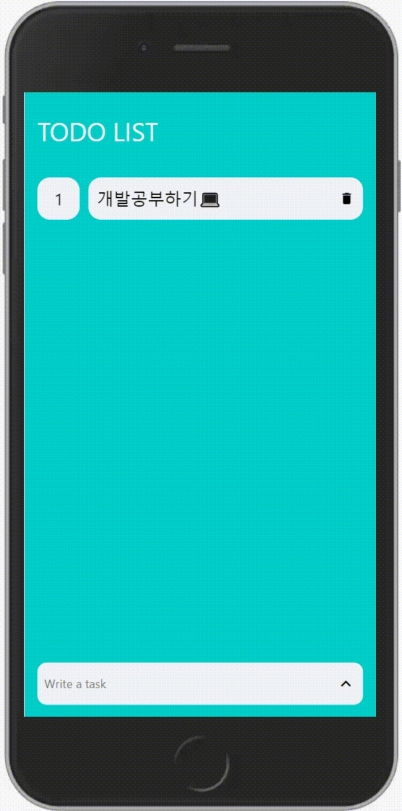
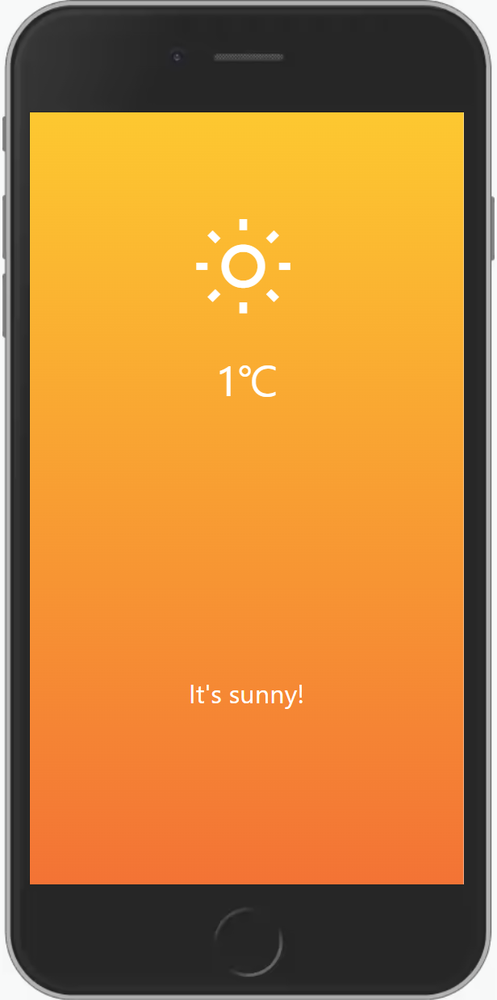

# React Native

> ## **개요**

### **[nomadcoders](https://nomadcoders.co/)사이트에서 강의를 수강하며 연습한 React-Native 프로젝트**

 

> ## **사용한 언어**

-   ### **HTML**
-   ### **CSS**
-   ### **JS(React-Native)**

 

> ## **프로젝트**

  

## **To Do List**

  
 

## **Weather App**

